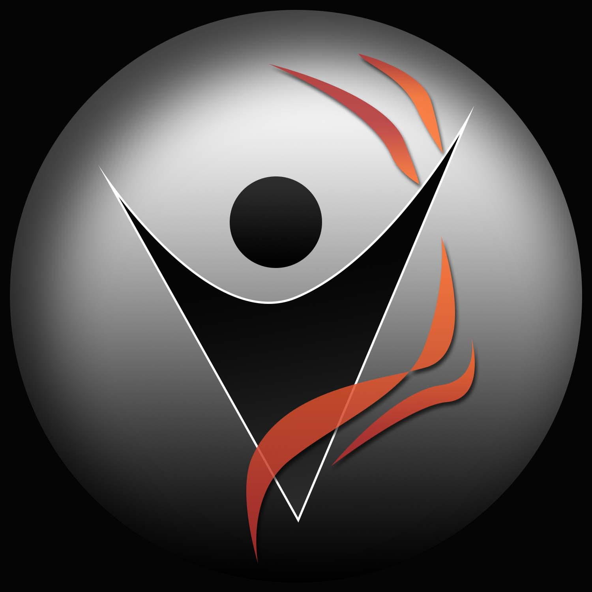

<!-- PROJECT SHIELDS -->

[![MIT License][license-shield]][license-url]
 
 

<!-- PROJECT LOGO -->
 

  

  <h3 align="center">Fit Photage</h3>

  

    iOS Application
  

<!-- TABLE OF CONTENTS -->

  
Table of Contents

  <ol>
    <li>
      <a href="#about-the-project">About The Project</a>
      <ul>
        <li><a href="#built-with">Built With</a></li>
      </ul>
    </li>
    <li><a href="#contributors">Contributors</a></li>
    <li><a href="#license">License</a></li>
    <li><a href="#acknowledgements">Acknowledgements</a></li>
  </ol>

<!-- ABOUT THE PROJECT -->
## About The Project

![Fit Photage Logo][product-screenshot]

Fit Photage is an iOS application designed to connect a fitness coach with their students. The intention was to allow the coach to send customized workouts to individual students and exchange communication and documentation.

This app was a collaboration between Kevin Liao and I as part of our company: Winged Burro Studios

This application was never finished, as the client went a different direction with their business. Much of the application was still built and it was great experience for us as developers.

More information can be found on the 'projects' page of my portfolio website:
 
[Weston Mauz Projects](https://wmauz677.github.io/Mauz-Portfolio-Web/projects.html)

### Built With

Software
* [XCode](https://developer.apple.com/xcode/)
* [CocoaPods](https://cocoapods.org)

Languages
* [Swift](https://developer.apple.com/swift/)
* [Python](https://www.python.org)

Text Editors
* [Atom](https://atom.io)
* [Sublime Text](https://www.sublimetext.com)

Source Control
* [GitHub](https://github.com)
* [iTerm2](https://iterm2.com)

### Contributors

![MyCaddie Website Screenshot][liao-screenshot]
Kevin Liao
 

![MyCaddie Website Screenshot][mauz-screenshot]
Weston Mauz

<!-- LICENSE -->
## License

Distributed under the MIT License. See `LICENSE` for more information.

<!-- ACKNOWLEDGEMENTS -->
## Acknowledgements

Software
* [XCode](https://developer.apple.com/xcode/)
* [CocoaPods](https://cocoapods.org)
* [icons8](https://icons8.com)

Languages
* [Swift](https://developer.apple.com/swift/)

Text Editors
* [Atom](https://atom.io)
* [Sublime Text](https://www.sublimetext.com)

Source Control
* [GitHub](https://github.com)
* [iTerm2](https://iterm2.com)

Licensing
* [License](https://opensource.org/licenses/MIT)

Templates
* [README Template](https://github.com/othneildrew/Best-README-Template)

<!-- MARKDOWN LINKS & IMAGES -->
[status-shield]: https://img.shields.io/website?down_color=lightgrey&down_message=offline&style=for-the-badge&up_color=green&up_message=online&url=https%3A%2F%2Fwmauz677.github.io%2FMyCaddie-Web%2F
[status-link]: https://wmauz677.github.io/MyCaddie-Web/
[license-shield]: https://img.shields.io/github/license/wmauz677/Gaming-Glove?color=red&style=for-the-badge
[license-url]: https://github.com/wmauz677/Gaming-Glove/blob/master/LICENSE
[product-screenshot]: Images/liv-fit-logo.jpg
[liao-screenshot]: Images/liao-screenshot.png
[mauz-screenshot]: Images/mauz-screenshot.png
